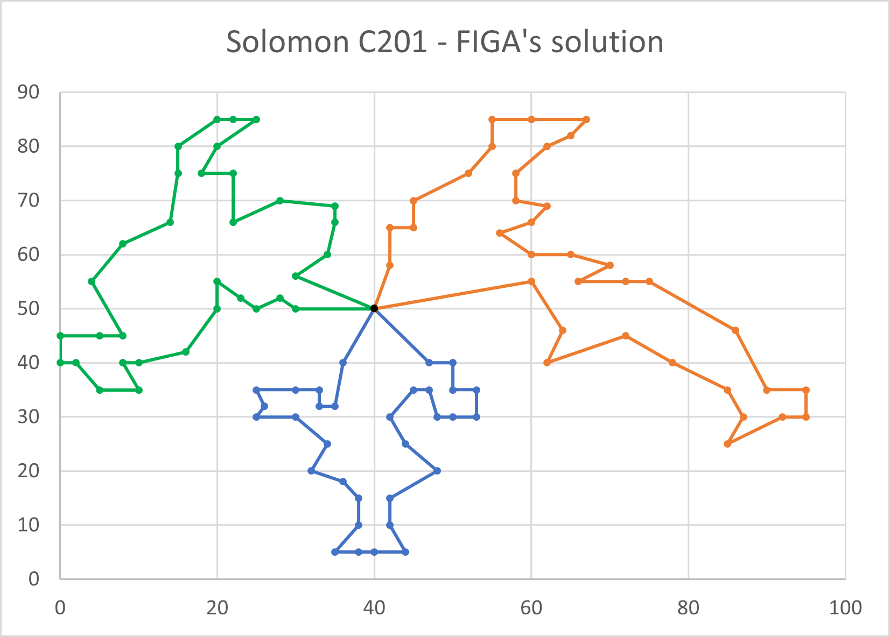

# My Edinburgh Napier University Honours Project

My Honours Project is aimed at investigating the performance of different methods of solving the Capacitated Vehicle Routing Problem with Time Windows (CVRPTW). The problem entails finding the most efficient combination of routes that multiple vehicles can take to deliver to every customer present in a set of customers. The edition of the VRP I'm investigating (the CVRPTW) is different because it constrains the capacity of each vehicle (and, therefore, the amount of packages each vehicle can carry) and the time windows in which each customer should receive their delivery. Such constraints and complexities make the CVRPTW [NP-Hard](https://en.wikipedia.org/wiki/NP-hardness).

The project investigates evolutionary algorithms (EA), heuristics, and EA-heuristic hybrids that solve the problem by aiming to find the combinations of routes that require the lowest cost to carry out. In other words, the cost is my objective function. Factors that to contribute to the cost of a solution are the amount of vehicles required and the total distance of each route. Any capacity and time window violations will render a solution infeasible and therefore, the solution will be rejected.

As part of the project, a custom Genetic Algorithm was developed. Here are solutions to two of the problem instances used during experimentation of the algorithm.

| 100-customer C101                      | 100-customer C201                      |
|----------------------------------------|----------------------------------------|
|  |  |

## How to execute the application (tutorial for Windows):
1. Install Python version 3.9,
2. Open the Windows command line and `cd` to the project root,
3. Create a virtual environment in the root folder of application;
   1. Using `python3.9 -m venv venv`,
4. Activate the virtual environment;
   1. Using `venv\Scripts\activate`,
5. Install the necessary packages;
   1. Using `pip install -r requirements.txt`,
6. Execute the application;
   1. Using `main.py` as the entry point,
   2. `main.py [ -h | --help ]` can provide further instructions,
   3. The file `compile.bat` can compile the app into a single executable;
      1. Note that the compiled executable can be found here: `../dist/main.exe`,
      2. The executable should be moved from `/dist` to the project root so that it can find the problems' directory `/solomon_100`.

## How to externally validate solutions:
1. Use the function `MMOEASA_write_solution_for_validation` from `data.py` in the Python application to output a solution to a CSV;
   1. There's also the invocation of this function in the main `mmoeasa` algorithm function in `../MMOEASA/mmoeasa.py` that needs to be uncommented,
   2. Note that as long as a non-dominated solution exists, the solution will be constantly written to a CSV during every generation of the algorithm, so exit the application after a non-dominated solution is found,
   3. This is so that we don't have to wait on the algorithm terminating before a solution can be written,
2. Compile the C application in `../MMOEASA/validator/`;
   1. Using either the Makefile or CMake,
3. Execute the application `objective_function.exe`;
   1. If you wish to use a different CSV file, give the application the file name as a command line argument,
   2. `objective_function [filename].csv`,
4. If the Python implementation is working correctly, then the objective function before and after the external validation should be equal, proving that the given solution is valid.

## How to write a solution to a CSV for graph creation:
1. After the non-dominated set has been returned from an algorithm, the function `write_solution_for_graph` from `data.py` can be invoked,
   1. The invocation occurs in `main.py`, which needs to be uncommented to work,
2. Once the file has been written, Excel can be used to create a graph from the data outputted; the format of the file is as follows:
   1. Column 1 lists the x coordinates of the first vehicle's destinations, and column 2 lists the first vehicle's destinations' y coordinates,
   2. Column 3 lists the second vehicle's destinations' x coordinates and column 4 list the second vehicle's destinations' y coordinates,
   3. And so on...
3. As Scatter Graph uses two-dimensional coordinates to plot points on a graph, and Excel allows a list of x coordinates as well as y coordinates to be selected for one series of data, which we can substitute the destinations' x and y coordinates for to show a vehicle's route as a series of data.
